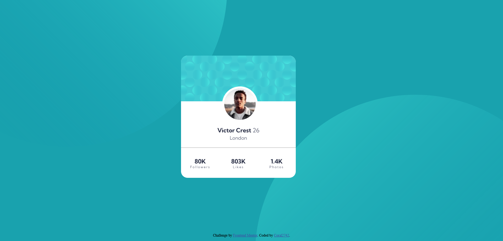
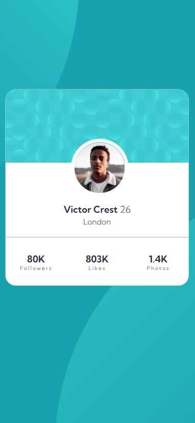

# Frontend Mentor - Profile Card Component solution

This is a solution to the [Profile Card Component](https://www.frontendmentor.io/challenges/profile-card-component-cfArpWshJ). Frontend Mentor challenges help you improve your coding skills by building realistic projects. 

## Table of contents

- [Overview](#overview)
  - [The challenge](#the-challenge)
  - [Screenshot](#screenshot)
  - [Links](#links)
- [My process](#my-process)
  - [Built with](#built-with)
  - [What I learned](#what-i-learned)
  - [Continued development](#continued-development)
  - [Useful resources](#useful-resources)
- [Author](#author)


## Overview

### The challenge

Users should be able to:

- View the optimal layout depending on their device's screen size

### Screenshot






### Links

- My Solution URL: [https://www.frontendmentor.io/solutions/profile-card-with-html-css-grid-WcrOHGeN5](https://www.frontendmentor.io/solutions/profile-card-with-html-css-grid-WcrOHGeN5)
- Live Site URL: [https://coral2742.github.io/Profile-Card-with-HTML-CSS-Grid/](https://coral2742.github.io/Profile-Card-with-HTML-CSS-Grid/)

## My process

### Built with

- Semantic HTML5 markup
- Google Fonts
- CSS custom properties
- CSS Grid
- Mobile-first workflow

### What I learned

I learned to...

· Define colors as variables:

```css
:root{
    --Dark-cyan: hsl(185, 75%, 39%);
    --Very-Dark-Desaturated-Blue: hsl(229, 23%, 23%);
    --Dark-Grayish-Blue: hsl(227, 10%, 46%);
    --Dark-Gray: hsl(0, 0%, 59%);
}
```

· Superimpose images: To put one image on top of the other, both images must be positioned absolutely.
  
  ```css
.card-imagen{
    position: absolute;
}

.top{
    position: absolute;
    background-size: contain;
    background-repeat: no-repeat;
    height: 978px;
    width: 978px;
    top: -528px;
    left: -284px;
}
  ```

· Space Between Words and Between Letters:

```css
.unidad{
    font-size: 10px;
    letter-spacing: 2px;
    width: 400;
    color:var(--Dark-Grayish-Blue);
    font-weight: 400;
}
```

· CSS Grid Layout:

```css
.stats{
    display: grid;
    font-family: 'Kumbh Sans', sans-serif;
    grid-template-columns: 1fr 1fr 1fr;
}
```


### Continued development

This was the second challenge I focused using HTML and CSS from the platform [Frontend Mentor](https://www.frontendmentor.io/challenges).


### Useful resources

- [Página web de Manz.dev](https://manz.dev/) - This helped me finding information about HTML and CSS with the cheatsheet posted. Thanks @ManzDev
- [https://developer.mozilla.org/es/](https://developer.mozilla.org/es/) - This page solved doubts related to HTML and CSS


## Author

- Github - [Coral2742](https://github.com/coral2742)
- Frontend Mentor - [@coral2742](https://www.frontendmentor.io/profile/coral2742)
- Instagram - [@coral2742](https://www.instagram.com/coral2742)
- Twitter - [@coral2742](https://twitter.com/coral2742)
